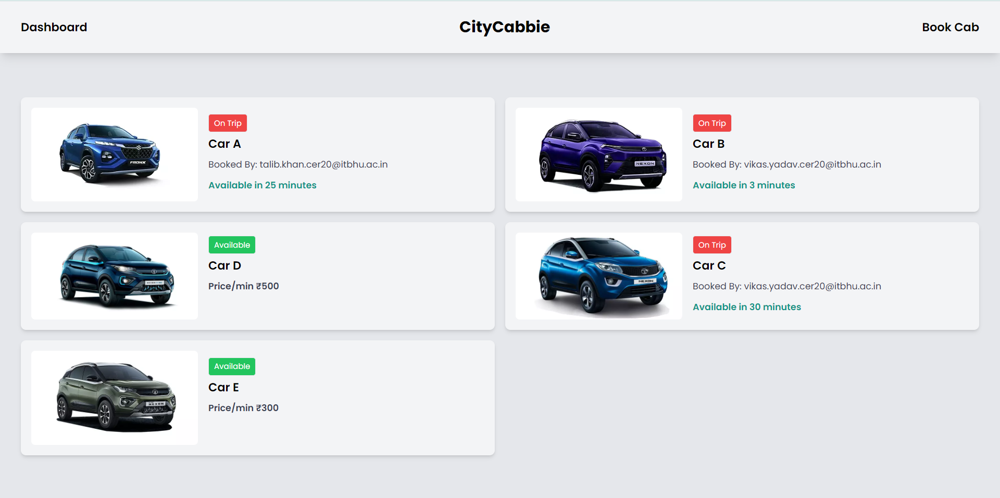
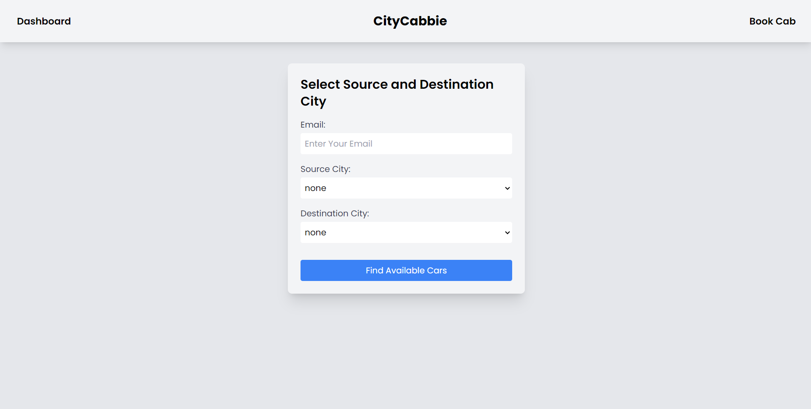

# CityCabbie

Welcome to CityCabbie, your one-stop solution for hassle-free cab booking. With CityCabbie, you can quickly book cabs for your travel needs at affordable prices. Our service ensures secure cabs, punctuality, and adherence to all traffic rules, providing you with a safe and comfortable journey.

## How to Run the Project

    node version= v21.3.0
    react version= v18.2.0

### Backend Setup
1. Navigate to the `backend` directory.
2. Install the required npm packages by running:
    npm i
3. Create a `.env` file in the `backend` directory and add the following details:
    MONGO_URI = <MongoDB URL>

    Email_User = <Your Gmail Address>

    Email_Pass = <Your App Password>
Replace `<MongoDB URL>`, `<Your Gmail Address>`, and `<Your Gmail Password>` with your MongoDB URL, Gmail address, and Gmail password respectively.
4. Start the server by running:
    npm start

### Frontend Setup
1. Navigate to the `frontend` directory.
2. Install the required npm packages by running:
    npm i
3. Start the frontend application by running:
    npm start

## Project Description

CityCabbie is a cab booking service that allows users to easily book cabs for their travel needs. Users can select their source and destination cities and view the available cabs along with their prices. After selecting a cab, users can book it, and upon successful booking, they will receive a confirmation email containing all the details of their booking.

To book a cab, simply click on the "Book Cab" link in the navbar, select your source and destination cities, choose a cab, and proceed with the booking. CityCabbie ensures affordable pricing, secure cabs, and timely service, making it the perfect choice for your travel needs.

